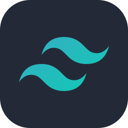
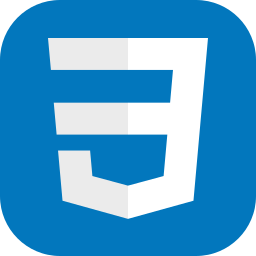
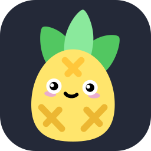

## About me
- My name is Simone 👋
- I'm a Graphic Designer and Illustrator ✏️
- I'm currently studying at Factoria F5 💻
- I wish to gain experience in Web Design and Programming 💼

## My skills

  
    
  
  
  
  
  
  
  
  
  
  
  

## Contact

- Linkedin: https://www.linkedin.com/in/avilarranz/
- Instagram: @avilarranz

<!--
**simoneavilarranz/simoneavilarranz** is a ✨ _special_ ✨ repository because its `README.md` (this file) appears on your GitHub profile.

Here are some ideas to get you started:

- 🔭 I’m currently working on ...
- 🌱 I’m currently learning ...
- 👯 I’m looking to collaborate on ...
- 🤔 I’m looking for help with ...
- 💬 Ask me about ...
- 📫 How to reach me: ...
- 😄 Pronouns: ...
- ⚡ Fun fact: ...
-->
